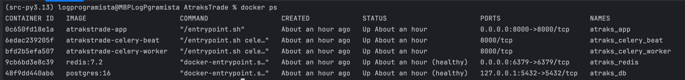
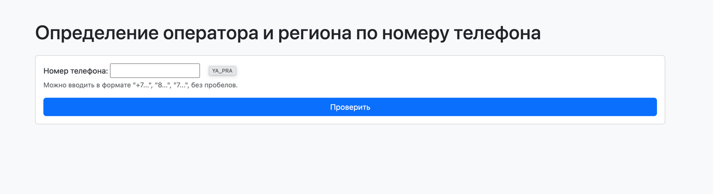
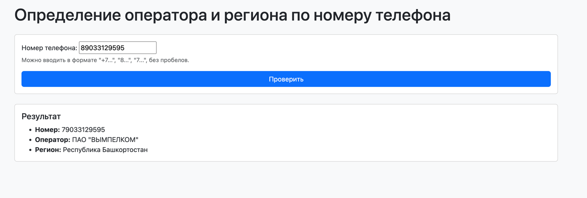
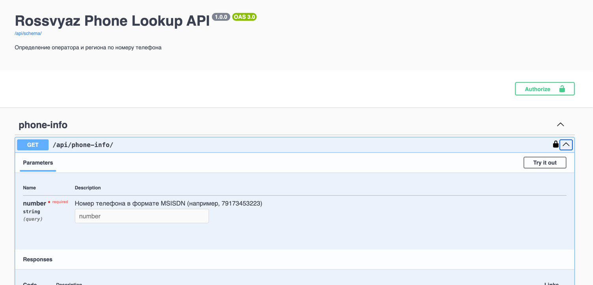
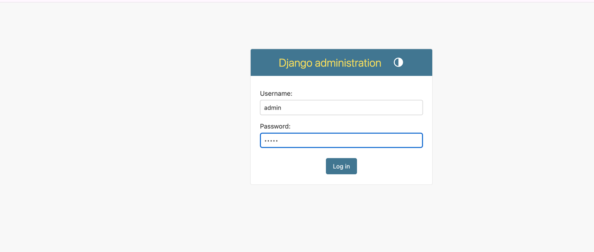

# AtraksTrade

Для запуска проекта необходимо выполнить следующие шаги:
Установить утилиты Make и Docker на вашу систему.

make help - показать доступные команды Makefile.

make env - Для .env файла.
make up - Запустить контейнеры Docker.
make update_rossvyaz - Получить данные Россвязи.

Далее можно будет командой docker ps посмотреть запущенные контейнеры.

По адресу http://localhost:8000/ будет доступен сам проект.

Введите номер и нажмите кнопку "Проверить".

По адресу http://localhost:8000/api/docs/ будет доступна документация по API проекта.

После запуска можно будет перейти в админ панель с паролем admin и логином admin по адресу http://localhost:8000/admin.
